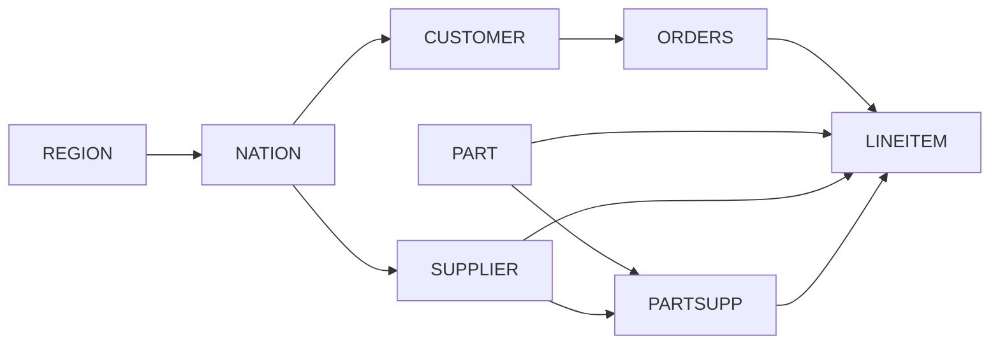
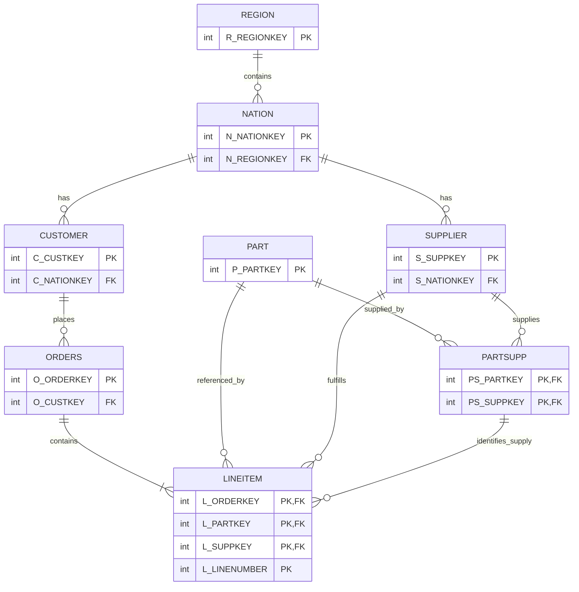

```mermaid
flowchart LR
    REGION --> NATION
    NATION --> SUPPLIER
    NATION --> CUSTOMER
    CUSTOMER --> ORDERS
    ORDERS --> LINEITEM
    PART --> PARTSUPP
    SUPPLIER --> PARTSUPP
    PART --> LINEITEM
    SUPPLIER --> LINEITEM
    PARTSUPP --> LINEITEM
    classDef active fill:#d1fae5,stroke:#059669,stroke-width:1px,color:#064e3b
```

```mermaid
erDiagram

    REGION {
        int R_REGIONKEY PK
    }

    NATION {
        int N_NATIONKEY PK
        int N_REGIONKEY FK
    }

    SUPPLIER {
        int S_SUPPKEY PK
        int S_NATIONKEY FK
    }

    CUSTOMER {
        int C_CUSTKEY PK
        int C_NATIONKEY FK
    }

    PART {
        int P_PARTKEY PK
    }

    PARTSUPP {
        int PS_PARTKEY PK, FK
        int PS_SUPPKEY PK, FK
    }

    ORDERS {
        int O_ORDERKEY PK
        int O_CUSTKEY FK
    }

    LINEITEM {
        int L_ORDERKEY PK, FK
        int L_PARTKEY PK, FK
        int L_SUPPKEY PK, FK
        int L_LINENUMBER PK
    }

    REGION ||--o{ NATION : contains
    NATION ||--o{ SUPPLIER : has
    NATION ||--o{ CUSTOMER : has
    CUSTOMER ||--o{ ORDERS : places
    ORDERS ||--|{ LINEITEM : contains
    PART ||--o{ PARTSUPP : supplied_by
    SUPPLIER ||--o{ PARTSUPP : supplies
    PART ||--o{ LINEITEM : referenced_by
    SUPPLIER ||--o{ LINEITEM : fulfills
    PARTSUPP ||--o{ LINEITEM : identifies_supply
```

